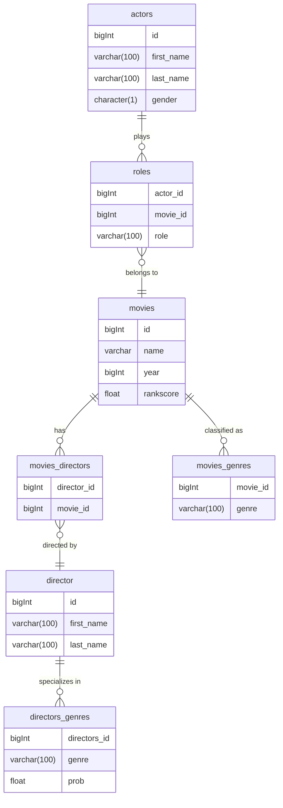

# ERD table database postgres

ERD table database cinema

```mermaid
erDiagram

actors {
    bigInt id
    varchar(100) first_name
    varchar(100) last_name
    character(1) gender
}

director {
    bigInt id
    varchar(100) first_name
    varchar(100) last_name
}

directors_genres {
    bigInt directors_id
    varchar(100) genre
    float prob
}

movies {
    bigInt id
    varchar name
    bigInt year
    float rankscore
}

movies_directors {
    bigInt director_id
    bigInt movie_id
}

movies_genres {
    bigInt movie_id
    varchar(100) genre
}

roles {
    bigInt actor_id
    bigInt movie_id
    varchar(100) role
}


actors ||--o{ roles : "plays"
roles }o--|| movies : "belongs to"

movies ||--o{ movies_directors : "has"
movies_directors }o--|| director : "directed by"

movies ||--o{ movies_genres : "classified as"

director ||--o{ directors_genres : "specializes in"


```
